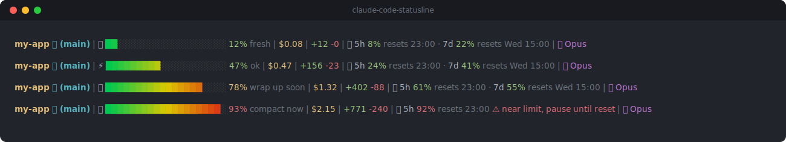

# ⚡ Claude Code Statusline

> One file that turns the Claude Code status line into a real dashboard: context window usage, token burn, session cost, and 5-hour / weekly rate limit reset times, with a hint that tells you when to `/compact`. Bash for macOS and Linux, PowerShell for Windows.




Runs locally. Costs zero tokens. No jq, no Python, no Node.

---

## Table of Contents

- [What Is It?](#what-is-it)
- [Install with One Prompt](#install-with-one-prompt)
- [Manual Install](#manual-install)
  - [macOS / Linux](#macos--linux)
  - [Windows](#windows)
- [How to Read It](#how-to-read-it)
- [What's Inside](#whats-inside)
- [Customize](#customize)
- [FAQ](#faq)
- [Reference](#reference)
- [License](#license)

---

## What Is It?

The status line (statusline) is the info bar pinned to the bottom of Claude Code, like the status bar in VS Code. You enable it with the `statusLine` setting in `settings.json` or the `/statusline` command, and Claude Code sends it a JSON payload after every message. This script turns that payload into something you can act on.

Most status lines show numbers. This one adds the verdict: `47% ok` means keep working, `78% wrap up soon` means finish the current task, `93% compact now` means run `/compact` before answer quality drops.

---

## Install with One Prompt

Never touched a Claude Code config file? You don't have to. Paste this into any Claude Code session:

```text
Install this status line for me: pick the right script for my OS from
https://github.com/nasri-mohamed/claude-code-statusline
(statusline.sh for macOS/Linux, statusline.ps1 for Windows), download it
to my ~/.claude directory, make it executable if needed, then set it as
"statusLine" in ~/.claude/settings.json and confirm it renders.
```

Claude downloads the script, wires up the settings, and verifies it. Done.

---

## Manual Install

### macOS / Linux

```bash
curl -fsSL https://raw.githubusercontent.com/nasri-mohamed/claude-code-statusline/main/statusline.sh \
  -o ~/.claude/statusline.sh && chmod +x ~/.claude/statusline.sh
```

Add this to `~/.claude/settings.json`:

```json
{
  "statusLine": {
    "type": "command",
    "command": "bash ~/.claude/statusline.sh"
  }
}
```

### Windows

In PowerShell:

```powershell
Invoke-WebRequest https://raw.githubusercontent.com/nasri-mohamed/claude-code-statusline/main/statusline.ps1 `
  -OutFile "$env:USERPROFILE\.claude\statusline.ps1"
```

Add this to `%USERPROFILE%\.claude\settings.json` (use your real path):

```json
{
  "statusLine": {
    "type": "command",
    "command": "powershell -NoProfile -ExecutionPolicy Bypass -File \"C:\\Users\\YOU\\.claude\\statusline.ps1\""
  }
}
```

Windows Terminal is recommended for truecolor and emoji. WSL and Git Bash users can use `statusline.sh` exactly like macOS/Linux.

Restart Claude Code and the bar appears.

---

## How to Read It

| You see | It means | What to do |
|---------|----------|------------|
| `🟢 12% fresh` | Context nearly empty | Take on the big refactor |
| `⚡ 47% ok` | Normal usage | Nothing, keep working |
| `🔥 78% wrap up soon` | Context getting low | Finish the current task |
| `🚨 93% compact now` | Answer quality about to drop | Run `/compact` |
| `⏱ 5h 24% resets 19:50` | 5-hour rate limit, 24% used | Plan around the reset time |
| `⚠ near limit, pause until reset` | A rate limit passed 90% | Take a break until the shown time |

The rest of the line: repo name, git branch, session cost in dollars, lines added and removed, current model.

---

## What's Inside

| Feature | Detail |
|---------|--------|
| Context bar | 20 blocks, 24-bit color gradient from green to red |
| Action hints | Plain text next to every emoji, never a guess |
| Rate limits | 5-hour and 7-day windows with local reset times (Pro and Max plans) |
| Cost + velocity | Live session cost, lines added and removed |
| Git awareness | Repo name and branch, read without touching git locks |
| Zero dependencies | Bash version parses JSON with built-in regex, PowerShell version uses `ConvertFrom-Json` |
| Cross-platform | BSD date, GNU date, and .NET time handling |

---

## Customize

Everything is in one readable file:

| Want | Change |
|------|--------|
| Wider or narrower bar | `BAR_WIDTH = 20` |
| Different warning levels | the `90` / `70` / `20` thresholds |
| Your own hint text | the `hint` strings next to each threshold |
| Other colors | the ANSI variables at the top |

Claude Code sends the full status JSON on stdin: model, workspace, git worktree, vim mode, and more. In Bash, grab any extra field with the built-in `json_str` and `json_num` helpers. In PowerShell, it's already a parsed object.

---

## FAQ

**Does it cost tokens?** No. It runs locally after each message.

**How do I see how much context Claude Code has left?** That's the gradient bar: it fills as the context window fills, and the hint next to it says when to act.

**Can I check my Claude usage limits without opening claude.ai?** Yes. The ⏱ segment shows the 5-hour and 7-day windows with the exact local time each one resets.

**How do I track what a session costs?** The dollar figure is the running session cost, straight from Claude Code's own payload.

**Rate limits don't show?** They exist only on Pro and Max plans, and appear after the first response of a session. On API billing that segment hides itself.

**No colors?** Your terminal needs truecolor support. iTerm2, Apple Terminal, Kitty, WezTerm, and Windows Terminal all have it.

**Which Windows shell?** The `.ps1` targets Windows PowerShell 5.1, so it also runs on PowerShell 7+. No modules needed.

---

## Reference

- [Status line official docs](https://code.claude.com/docs/en/statusline)
- [Claude Code settings reference](https://code.claude.com/docs/en/settings)
- [settings.json schema](https://json.schemastore.org/claude-code-settings.json)
- [Status line JSON field guide](https://gist.github.com/AKCodez/ffb420ba6a7662b5c3dda2edce7783de) by AKCodez, which this project builds on
- [Gist mirror of this project](https://gist.github.com/nasri-mohamed/2bdc05ea1f145807e39a9d4d78ff552d)

---

## License

[MIT](LICENSE). Do whatever you want with it.

⭐ If it saved you from a mid-refactor context wipeout, star the repo so others find it.
